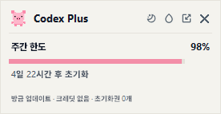

# Codex Usage Widget

📖 [한국어 사용설명서 (Korean user manual)](docs/사용설명서.md)

A small always-on-desktop Windows widget that shows your current Codex usage limits. It only displays the rate-limit windows Codex actually returns — no guessing of names or ordering. If your account has only a weekly limit, you see one row; if it also has a 5-hour limit, both rows appear.



## Requirements

- Windows 10/11
- Python 3.11+
- Codex desktop app or Codex CLI installed
- Signed in to Codex with your ChatGPT account

## Install & Run

Open the project folder in PowerShell and run:

```powershell
python -m venv .venv
.\.venv\Scripts\python.exe -m pip install -e .
```

Then double-click `실행.bat`, or run directly:

```powershell
.\.venv\Scripts\pythonw.exe widget.pyw
```

## Usage

- **Header icons**: theme, transparency, mini mode, hide
- **Right-click menu**: refresh, dark/light toggle, mini mode, smart position switching, scale, mini scale, pet picker, hide to tray, quit
- **Mini mode**: a transparent strip with a 14px theme-aware Codex icon, short labels (`W`, `5h`), and battery bars at 5px spacing. The battery fill and inner percentage show the **remaining** ratio (100 − usage). Double-click to return to full mode.
- **Moving the widget**: drag any empty area; the position is saved.
- **Smart position switching**: when ON, the widget floats above other windows only while the widget itself or Codex (a terminal or the ChatGPT app) is in the foreground. When OFF, the widget stays always on top.

Progress colors shift from low (green) through mid (yellow) to high (pink), and the exact percentage is always shown regardless of color. If the server returns credits or limit-reset credits, they appear in the bottom status area.

## Troubleshooting

- **Codex not found**: install the Codex desktop app or CLI, then relaunch. If it is installed in an unusual location, set the `CODEX_EXE` environment variable to the full path of `codex.exe`.
- **Login required**: complete the ChatGPT sign-in in the Codex desktop app or CLI, then refresh the widget.
- **No tray icon**: some environments have no usable system tray. The widget itself and the right-click quit menu keep working.
- **Fewer usage rows than expected**: the widget never fabricates 5-hour/weekly windows the server did not return.

## Privacy

The widget asks the local official Codex `app-server` process for `account/rateLimits/read` only. It never reads or modifies `auth.json` directly, and it never stores, logs, or displays OAuth tokens, e-mail addresses, user IDs, or account IDs. The config file holds display settings only (theme, transparency, scale, position, pet).

## License & Assets

Pet assets are shared with the same author's MIT project [kindsusu/claude-usage-widget](https://github.com/kindsusu/claude-usage-widget).

Theme, transparency, and mini-mode use user-provided SVGs in `assets/icon`. The line variant of each SVG maps to the default state and the fill variant to hover/active; they are converted to transparent PNGs in the same folder so Tk can display them directly. Header button icons render at 14px to match the `Codex Plus` 10pt title height, with a 20px click target. The tray uses `codex.svg`; mini mode uses `codex-color.svg` for the light theme and the derived `codex-color-dark.svg` for the dark theme. The SVG originals are kept in editable form. The hide icon's fallback comes from [Tabler Icons](https://github.com/tabler/tabler-icons); the corresponding MIT notice is included in `THIRD_PARTY_NOTICES.md`.
