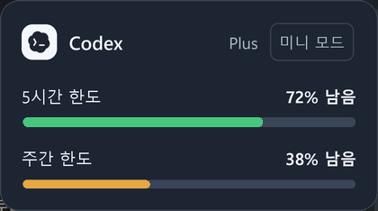
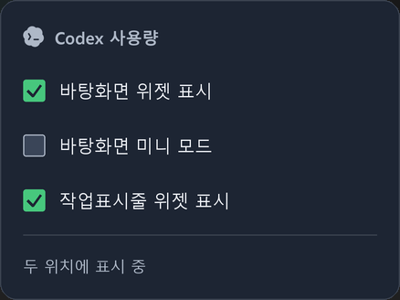

# Desktop card redesign verification — 2026-09-14

The approved reference is `taskbar-widget-design.html`; the current contract is
[desktop-card-design.md](desktop-card-design.md). Astra planned and reviewed the
change, Sol implemented the desktop renderer and native integration, and Terra
updated the documentation and Obsidian records.

## Results

- **264 tests passed**. Ruff passed. Basedpyright reported **0 errors, 0 warnings**
  using the development environment. Runtime `pip check` passed.
- The actual Windows 11 application passed **26 integration checks** using an
  isolated configuration and example remaining values of 72% and 38%.
- Physical left-button input verified taskbar Codex open/re-click close/reopen,
  both quick and 150 ms held clicks, Escape and click-away dismissal, all three
  visibility checkboxes, mini restore, desktop brand re-click, and usage details.
- Both surfaces were hidden and restored through the tray command's application
  signal. The tray command route was invoked directly; this was not a physical
  click on the tray icon. The advanced menu was opened with physical right-click;
  its theme command was invoked directly to verify callback execution.
- Light and dark full/mini/panel screenshots were captured from the actual app.
  At 150% Windows DPI, full is **420×234**, mini **366×69**, and panel **438×328**.
  Applying 150% user scale to the full card produces **630×351**, once per scale.
- Physical dragging moved the card and persisted the new position. Separate
  regression tests cover releasing a body drag over a button without invoking it.
- The user's original configuration was unchanged during verification.

## Regression lessons

1. A taskbar button release arrives through the native-to-Tk queue. FocusOut must
   not destroy its open panel first and turn the same release into a reopen.
   Observe the originating button, allow the pending toggle, and restrict delayed
   cleanup to the exact old window instance.
2. A desktop panel must not cover its originating Codex button. Prefer the right
   side of the card, then the left, below, or above within the monitor work area.
3. Button release alone is not a click. Require a matching press region, and let
   body drags reach the root release handler so their position is saved.
4. Tk PhotoImage plus a chroma key does not preserve CSS alpha compositing. Flatten
   internal strokes onto the surface and use a binary outside mask to avoid a white
   halo. Supersample text before downscaling to prevent bitmap-like Korean glyphs.
5. Inspect the rendered application, not only unit tests or isolated Pillow output.
   Actual clicks exposed the panel overlap that pure state tests missed.

The earlier advanced native-menu lifetime fix remains in `DEVELOPMENT_NOTES.md`:
retain BooleanVars, pre-schedule polling before the nested modal loop, cancel the
native popup, suppress the held release, and defer only menu destruction.

## Visual scope and limits

The card layout, Codex mark, sizes, remaining percentages, colors, and mini mode
follow the approved design. Tk uses a solid card surface with the user's existing
whole-window opacity; it does **not** reproduce CSS backdrop blur, the HTML shadow,
or separate per-element translucency. Rounded outside pixels use a binary mask.
The taskbar renderer keeps its existing per-pixel transparency.

This live review covers the primary horizontal Windows 11 taskbar at 150% DPI.
The pure renderer also covers 100% DPI. Windows 10, secondary/vertical taskbars,
and all monitor layouts were not verified on physical devices. The new left-click
panel passed held-click → Escape; the earlier held-click → Escape limitation in
the separate advanced native menu was not newly verified as fixed.

